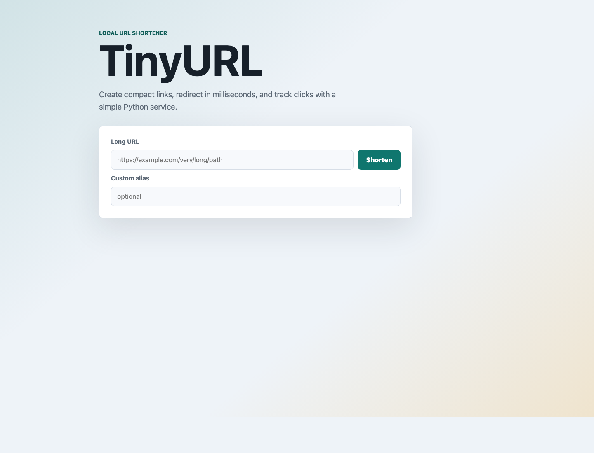

# TinyURL Python App

A local TinyURL-style URL shortener built with Python, Flask, SQLite, Base62 keys, bearer-token authentication, custom aliases, redirects, and click tracking.

The implementation follows the workflow from `Slides+-+Section+12+-+URL+Shortener.pdf`:

- `POST /api/shorten` creates a short URL.
- `GET /<short_key>` redirects to the original URL.
- Base62 encoding creates compact keys from unique database IDs.
- SQLite persists users and URL mappings.
- An in-process LRU cache speeds up repeated redirects.
- Authenticated users can list and delete their own URLs.

## Web Page Screenshot



## Project Structure

```text
.
├── app.py
├── requirements.txt
├── tinyurl/
│   ├── app.py
│   ├── auth.py
│   ├── base62.py
│   ├── cache.py
│   ├── db.py
│   ├── static/styles.css
│   └── templates/index.html
├── docs/
│   ├── API.md
│   ├── images/tinyurl-home.png
│   └── SYSTEM_DESIGN.md
└── tests/test_app.py
```

## Step-by-Step Local Setup

### 1. Open the project

```bash
cd "/Users/shubhamgodha/Documents/Github Repos/clone_apps/tiny-url"
```

### 2. Create a virtual environment

```bash
python3 -m venv .venv
```

### 3. Activate the virtual environment

macOS or Linux:

```bash
source .venv/bin/activate
```

Windows PowerShell:

```powershell
.venv\Scripts\Activate.ps1
```

### 4. Install dependencies

```bash
pip install -r requirements.txt
```

### 5. Run the app

```bash
python app.py
```

Open this URL in your browser:

```text
http://127.0.0.1:5000
```

The SQLite database is created automatically at:

```text
instance/tinyurl.sqlite3
```

## Try It With Curl

### Create an anonymous short URL

```bash
curl -X POST http://127.0.0.1:5000/api/shorten \
  -H "Content-Type: application/json" \
  -d '{"long_url":"https://example.com/very/long/path/to/resource"}'
```

### Follow the short URL

Use the `short_key` returned by the previous command:

```bash
curl -i http://127.0.0.1:5000/1
```

### Register a user

```bash
curl -X POST http://127.0.0.1:5000/api/auth/register \
  -H "Content-Type: application/json" \
  -d '{"email":"person@example.com","password":"password123"}'
```

Save the returned `access_token`.

### Create a user-owned URL

```bash
curl -X POST http://127.0.0.1:5000/api/shorten \
  -H "Content-Type: application/json" \
  -H "Authorization: Bearer <access_token>" \
  -d '{"long_url":"https://example.com/private/article","custom_alias":"myArticle"}'
```

### List your URLs

```bash
curl http://127.0.0.1:5000/api/urls \
  -H "Authorization: Bearer <access_token>"
```

### Delete your URL

```bash
curl -X DELETE http://127.0.0.1:5000/api/url/myArticle \
  -H "Authorization: Bearer <access_token>"
```

## Run Tests

```bash
python -m unittest
```

## Configuration

You can override defaults with environment variables:

```bash
SECRET_KEY="replace-this-in-real-use" \
DATABASE="instance/tinyurl.sqlite3" \
BASE_URL="http://127.0.0.1:5000" \
CACHE_SIZE="1024" \
python app.py
```

## More Documentation

- [API reference](docs/API.md)
- [System design notes](docs/SYSTEM_DESIGN.md)
- [Code walkthrough](docs/CODE_WALKTHROUGH.md)
- [Code walkthrough PDF](docs/CODE_WALKTHROUGH.pdf)
