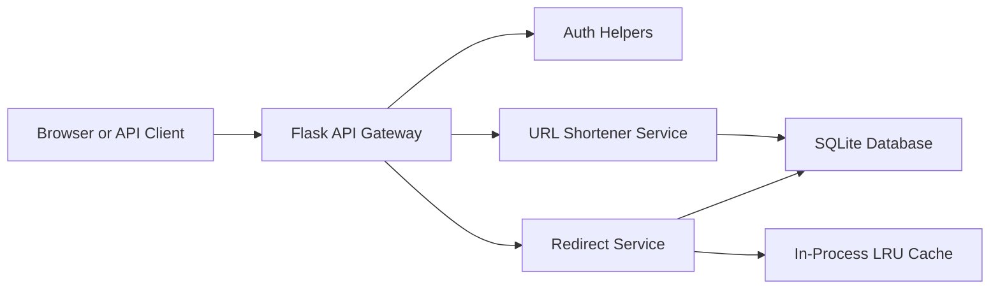

# TinyURL System Design Notes

This local application implements the core workflow from `Slides+-+Section+12+-+URL+Shortener.pdf` in a lightweight way.

## Requirements Covered

- Shorten a valid `http` or `https` long URL.
- Redirect `GET /<short_key>` to the original URL using HTTP `302`.
- Return the same short URL for duplicate public long URLs.
- Support custom aliases.
- Support registration, login, bearer-token authentication, user-owned URL listing, and deletion.
- Track redirect click count.
- Support optional `expires_at` timestamps.

## Local Architecture

## Key Generation

The PDF recommends Base62 because it is compact, deterministic, and fast. This app follows that approach:

1. Insert a URL row into SQLite.
2. Use the auto-incrementing integer `id` as the unique counter.
3. Base62-encode the integer into a short key.
4. Store the generated key back on the row.

For a distributed production system, the single SQLite counter would be replaced by a globally coordinated ID source such as PostgreSQL sequences, Redis atomic counters, Snowflake-style IDs, or Zookeeper as described in the slides.

## Collision Handling

- Generated keys are based on SQLite's unique row ID, so generated collisions do not occur locally.
- Custom aliases are protected by a unique database constraint.
- Duplicate long URLs are detected per owner. Public anonymous URLs are deduplicated globally, while authenticated user URLs are deduplicated per user.

## Cache Strategy

The slides describe Redis or Memcached for hot URL lookups. For local development this app uses an in-process LRU cache:

- Redirect checks cache first.
- On miss, it queries SQLite.
- Successful lookups are cached.
- Deleted URLs are removed from cache.

In production, replace `tinyurl/cache.py` with Redis and add cache TTLs.

## Production Evolution

- API gateway or load balancer for routing, rate limits, and TLS.
- PostgreSQL or DynamoDB for durable URL mappings.
- Redis for hot short-key lookups.
- Zookeeper, Redis atomic counters, or database sequences for distributed ID generation.
- Background jobs for expired URL cleanup and analytics aggregation.
- Observability with structured logs, metrics, and traces.
- Backups, replication, and failover for high availability.
